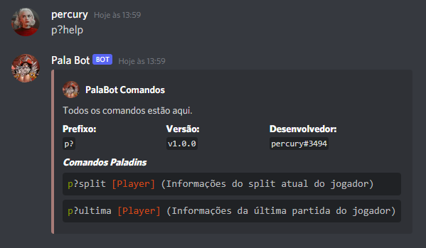
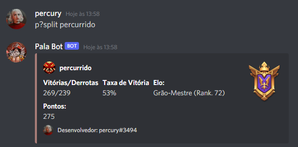

  

🧍 A discord bot to find information about a player 🤖

<h1 align="center">Pala Bot</h1>

 <a href="## Project Status :construction:">Project Status</a> • <a href="## License :white_check_mark:">License</a>

## Project Status :construction:
- Pala Bot | Project complete :white_check_mark:

## Usage

- To use this bot you need to have <a href="https://discord.com/">Discord</a> installed.
- Then paste this link <a href="https://discord.com/oauth2/authorize?client_id=776931888791158795&scope=bot&permissions=8
">https://discord.com/oauth2/authorize?client_id=776931888791158795&scope=bot&permissions=8</a> into your browser, and choose a server for the bot to be added to. Remembering that you have to have admin permissions to add the bot to some server.
- Ready! Now the bot is ready to use, start with p?help to learn the commands.

## Demonstration

## Technologies used :scroll:
- <a href="https://nodejs.org/en/">Node</a>
- <a href="https://discord.js.org/#/">Discord JS</a>

## License :white_check_mark:

- MIT License, <a href="./LICENSE">read more<a/>.

luisspassos &copy; 2021.

